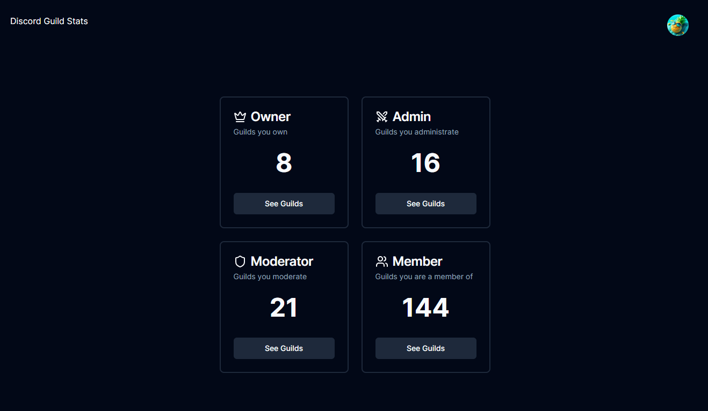

# Discord Guild Stats

### **Live: https://guild-stats.a1ex.fr**

Discord Guild Stats is a mini-project to view some stats from the Discord guilds you are on:

Built with Next.JS, NextAuth, shadcn/ui, TailwindCSS, Lucide

## Development :

The project can be tested with `npm run dev`, NextJS includes something like an HMR and Fast Reload.

You need to create an .env.local file which will be injected with the following variables :
- `DISCORD_API_BASE_URL`
- `DISCORD_CLIENT_ID`
- `DISCORD_CLIENT_SECRET`
- `JWT_SECRET`

(`NEXT_AUTH_URL` required in production with the canonical URL)

## Deploying 

> [!NOTE]
> As the app uses server functions, it is not possible to build it and export it statically.

I always prefer to deploy using Docker whenever possible.

For this project, it's possible to build the docker image with the Dockerfile supplied and launch it with `docker run -p 3000:3000 [--env-file | --env] <envs> discord-guild-stats` (build `docker build -t discord-guild-stats .`)

Also possible to build it with `npm run build`.